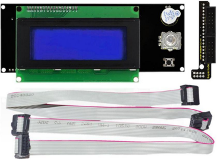
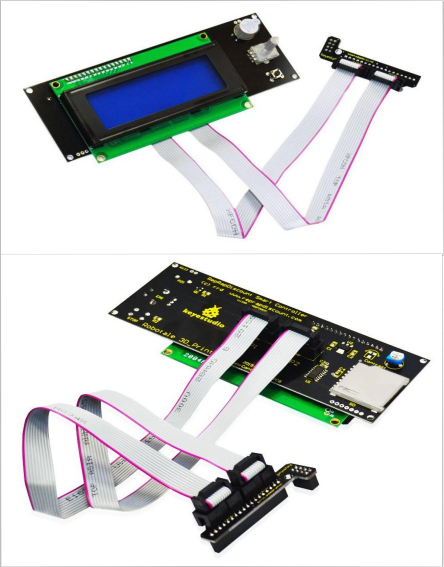

# KS0477 Keyestudio 3D Smart Controller 2004LCD Module+Cable+Adapter Board

## 1. Description

This kit mainly consists of 1 smart controller, 1 L-shaped adapter board and 2 FC cables. When in use, we plug the L-type adapter board into the RAMPS 1.4 main board and connect the smart controller to the RAMPS 1.4 main board with two FC cables. Pay attention please when connecting. EXP1 of smart controller is connected to EXP1 of RAMPS 1.4 motherboard , and EXP2 is connected to EXP2.

This kit mainly consists of 1 smart controller, 1 L-shaped adapter board and 2 FC cables. When in use, we plug the L-type adapter board into the RAMPS 1.4 main board and connect the smart controller to the RAMPS 1.4 main board with two FC cables. Pay attention please when connecting. EXP1 of smart controller is connected to EXP1 of RAMPS 1.4 motherboard , and EXP2 is connected to EXP2.

## 2. Component list

- Intelligent controller (2004LCD module) * 1
- L-shaped adapter board * 1
- FC cable * 2

## 3. Picture

